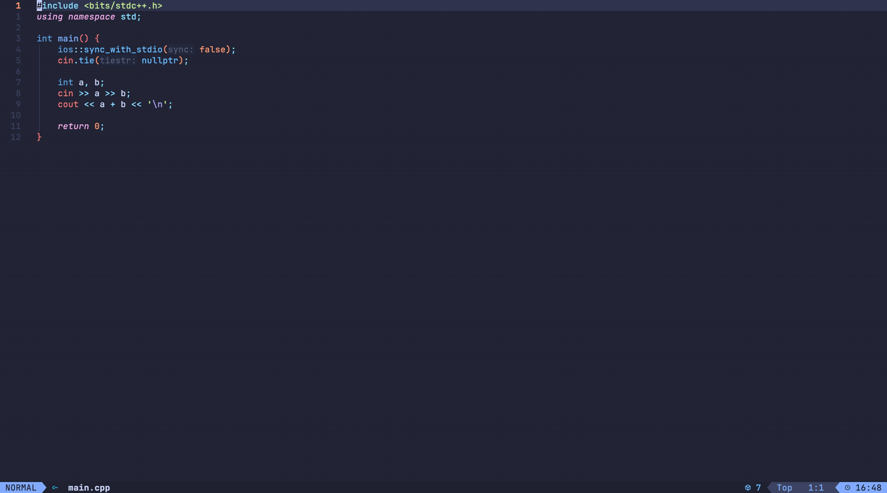

# pretest.nvim

Local competitive programming test runner for Neovim.

Compile, run, and judge test cases next to your source file. Test data is stored in a single `.prob` JSON file per problem under `.pretest/` (or `save_dir`).



## Features

- Language runners via `languages` (C++ and Python by default)
- Sidebar or floating UI (toggle at runtime)
- Edit **Input** / **Expected** in the UI; edit name and limits via commands
- Verdicts: AC, WA, RE, TLE, MLE, CE, Stopped
- Receive problems from [Competitive Companion](https://github.com/jmerle/competitive-companion)

## Requirements

- [Neovim](https://neovim.io/) 0.10+

## Install (lazy.nvim)

```lua
{
  "skrewbar/pretest.nvim",
  -- lazy = false, -- required for companion.listen_on_setup (startup receive)
  opts = {}, -- defaults; see docs/configuration.md
  cmd = "Pretest",
  keys = {
    { "<leader>tu", "<cmd>Pretest toggle<cr>", desc = "Toggle UI" },
    { "<leader>tt", "<cmd>Pretest toggle_layout<cr>", desc = "Toggle sidebar/float" },
    { "<leader>tR", "<cmd>Pretest run<cr>", desc = "Run all testcases" },
    { "<leader>tr", "<cmd>Pretest run_current<cr>", desc = "Run current testcase" },
    { "<leader>tn", "<cmd>Pretest run_current_no_compile<cr>", desc = "Run current testcase (no compile)" },
    { "<leader>tN", "<cmd>Pretest run_no_compile<cr>", desc = "Run all (no compile)" },
    { "<leader>ts", "<cmd>Pretest stop<cr>", desc = "Stop run" },
    { "<leader>ta", "<cmd>Pretest add<cr>", desc = "Add testcase" },
    { "<leader>te", "<cmd>Pretest edit<cr>", desc = "Edit/Focus" },
    { "<leader>td", "<cmd>Pretest delete<cr>", desc = "Delete testcase" },
  },
}
```

Other plugin managers and manual install: [docs/installation.md](docs/installation.md).

## Keymaps

Suggested `<leader>t` mappings (also in the snippet above):

| Keys | Command | Description |
|------|---------|-------------|
| `<leader>tu` | `:Pretest toggle` | Toggle UI |
| `<leader>tt` | `:Pretest toggle_layout` | Toggle sidebar/float |
| `<leader>tR` | `:Pretest run` | Run all testcases |
| `<leader>tr` | `:Pretest run_current` | Run current testcase |
| `<leader>tn` | `:Pretest run_current_no_compile` | Run current testcase (no compile) |
| `<leader>tN` | `:Pretest run_no_compile` | Run all (no compile) |
| `<leader>ts` | `:Pretest stop` | Stop an in-flight compile/run |
| `<leader>ta` | `:Pretest add` | Add testcase |
| `<leader>te` | `:Pretest edit` | Edit/Focus |
| `<leader>td` | `:Pretest delete` | Delete testcase |

UI-buffer keys (`r`, `R`, `s`, …) are listed in [Commands](docs/commands.md).

### which-key.nvim

[which-key.nvim](https://github.com/folke/which-key.nvim) v3 reads `desc` from the lazy.nvim `keys` table. For the `<leader>t` group label and icons, merge a `spec` into which-key's `opts`. Do not register icons from pretest: pretest is lazy-loaded, so `<leader>t` opens which-key before pretest loads and which-key falls back to auto icons from the `desc` text.

```lua
-- lua/plugins/pretest.lua
return {
  {
    "skrewbar/pretest.nvim",
    cmd = "Pretest",
    keys = {
      { "<leader>tu", "<cmd>Pretest toggle<cr>", desc = "Toggle UI" },
      { "<leader>tt", "<cmd>Pretest toggle_layout<cr>", desc = "Toggle sidebar/float" },
      { "<leader>tR", "<cmd>Pretest run<cr>", desc = "Run all testcases" },
      { "<leader>tr", "<cmd>Pretest run_current<cr>", desc = "Run current testcase" },
      { "<leader>tn", "<cmd>Pretest run_current_no_compile<cr>", desc = "Run current testcase (no compile)" },
      { "<leader>tN", "<cmd>Pretest run_no_compile<cr>", desc = "Run all (no compile)" },
      { "<leader>ts", "<cmd>Pretest stop<cr>", desc = "Stop run" },
      { "<leader>ta", "<cmd>Pretest add<cr>", desc = "Add testcase" },
      { "<leader>te", "<cmd>Pretest edit<cr>", desc = "Edit/Focus" },
      { "<leader>td", "<cmd>Pretest delete<cr>", desc = "Delete testcase" },
    },
    opts = {}, -- see docs/configuration.md
  },
  {
    "folke/which-key.nvim",
    optional = true,
    opts = {
      spec = {
        { "<leader>t", group = "Pretest", icon = "󰤑" },
        { "<leader>tu", icon = "󰖷" },
        { "<leader>tt", icon = "󰖯" },
        { "<leader>tR", icon = "󰐊" },
        { "<leader>tr", icon = "󰑮" },
        { "<leader>tn", icon = "󰑮" },
        { "<leader>tN", icon = "󰓦" },
        { "<leader>ts", icon = "󰓛" },
        { "<leader>ta", icon = "󰐕" },
        { "<leader>te", icon = "󰏫" },
        { "<leader>td", icon = "󰆴" },
      },
    },
  },
}
```

`optional = true` merges this block into an existing which-key install (for example LazyVim) and does nothing if which-key is not used.

## Docs

- [Installation (other plugin managers)](docs/installation.md)
- [Configuration](docs/configuration.md)
- [Commands](docs/commands.md)

## `.prob` files

Compatible with `.prob` files. Path layout and `save_dir` are documented in [Configuration](docs/configuration.md).

## Inspired by

- [CompetiTest.nvim](https://github.com/xeluxee/competitest.nvim)
- [Competitive Programming Helper](https://github.com/agrawal-d/cph)

## License

[Apache License 2.0](LICENSE)
